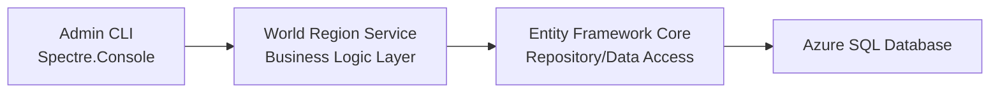

[JetFolio](../../../README.md) \ [docs](../../README.md) \ [Architecture Specifications](../README.md) \ [Admin CLI](README.md) \

# World Region Management

## Overview

The World Region management unit within the Admin CLI provides structured administrative commands for creating, updating, deleting, and retrieving world regions using an intuitive command-line interface built with Spectre.Console.

The core features of the Admin CLI World Management module are:

- Create, list, update, and delete world regions via CLI.
- Bulk upload world regions using JSON files.
- Flexible output formats (Table, JSON, Save to File).
- Validation and confirmation prompts are used to ensure data integrity.

---

## CLI Technology & Integration

### Technology Stack

- **CLI Framework:** Spectre.Console (C#)
- **Backend Integration:** ASP.NET Core Web API
- **Data Processing:** JSON file support for bulk operations
- **Logging & Monitoring**: Azure Monitor, Azure App Insights (via the API)

### Component Interaction



### CLI Interaction Flow

1. The administrator executes a CLI command.
2. The CLI collects and validates input (e.g., `RegionCode`, `RegionName`).
3. The CLI calls the World Region API, passing structured requests.
4. The API processes the request and returns a response.
5. The CLI displays formatted output (Table, JSON, or saved file).

### Validation Handling

Validation is split between the Admin CLI and the API to ensure efficient user interactions while maintaining strict business rule enforcement at the backend.

#### Admin CLI Validation (Basic User Input Checks)

- Ensures required fields are not empty before sending the request.
- Confirms correct data type formatting (e.g., Boolean values for `Enabled` flag).
- Positive interaction validation prompts (e.g., preventing empty entries).

#### API Validation (Strict Business Logic Enforcement)

- Validates region codes against UN M49 formatting rules
- Prevents duplicate region codes in the database.
- Enforces referential integrity for `ParentRegion` values.
- Applies soft delete constraints (e.g., preventing updates to obsolete regions).

#### Handling API Validation Errors

If the API rejects a request due to validation failures, the CLI will:

- Display meaningful error messages received from the API.
- Allow administrators to correct input and retry where applicable.

---

## CLI Command Mapping

## `world-region create`

##### Description

Creates a new world region, ensuring the provided data conforms to the UN M49 standard.

##### API Method(s) Called

- `POST /world-regions`

##### Behavior

- Prompt the administrator for:
  - `RegionCode` (validated against UN M49 format)
  - `RegionName`
  - `ParentRegion` (optional)
  - `Enabled` (true/false)
- Validates input and prevents duplicate region codes.
- Displays confirmation after successful creation.

### `world-region list`

##### Description

Lists all world regions with optional filtering and format selection.

##### API Method(s) Called

`GET /world-regions?includeObsolete=<true|false>`

##### Options

| Option                      | Description                                         |
| --------------------------- | --------------------------------------------------- |
| `--format=[table/json]`     | Specifies the format of the output (default: table) |
| `--output-file=<file-path>` | Saves the JSON output to a file.                    |
| `--include-obsolete`        | Include obsolete regions in the output              |
| `--enabled-only`            | Lists only enabled regions.                         |

##### Behavior

- If `--format=json` is used, outputs JSON structure.
- If `--output-file=<file-path>` is provided, saves JSON data for later use.
- The default behavior displays a formatted table in the CLI.

### `world-region update`

##### Description

Updates an existing world region's details.

##### API Method(s) Called

`PUT /world-regions/{regionCode}`

##### Behavior

- Prompts the administrator to enter the `RegionCode` to identify the record.
- Validates new inputs before persisting changes.
- Allows updates for: `RegionName`, `ParentRegion`, and `Enabled` flag
- Displays confirmation before applying updates.

### `world-region delete`

##### Description

Marks a world region as obsolete rather than deleting it permanently.

##### API Method(s) Called

`DELETE /world-regions/{regionCode}`

##### Behavior

- Prompts for the `RegionCode` of the region to be marked as obsolete.
- Requires confirmation before proceeding.

### `world-region get`

##### Description

Retrieves detailed information about a specific world region.

##### Service Method Called

`GetWorldRegionByCode(string regionCode)`

##### Behavior

- Accepts `RegionCode` as input.
- Displays detailed attributes of the requested world region.
- Returns an error message if the region code does not exist.

### `world-region upload <file-path>`

##### Description

Processes bulk world region data via a JSON file, creating new records and updating existing ones.

##### API Method(s) Called

`POST /world-regions/upload`

##### Behavior

- Reads and validates JSON file structure.
- Processes each record:
  - **Update** existing world regions if they already exist.
  - **Create** new records if they do not exist.
- Provide a **summary report** at the end, including:
  - Records created
  - Records updated
  - Errors encountered

---

## CLI Output Formats

### Table Format

Used for standard CLI display:

```shell
+------------+-------------+--------------+---------+
| RegionCode | RegionName  | ParentRegion | Enabled |
+------------+-------------+--------------+---------+
| 001        | World       | -            | True    |
| 002        | Africa      | 001          | True    |
+------------+-------------+--------------+---------+
```

### JSON Format

```json
[
  {
    "RegionCode": "001",
    "RegionName": "World",
    "ParentRegion": null,
    "Enabled": true
  },
  {
    "RegionCode": "002",
    "RegionName": "Africa",
    "ParentRegion": "001",
    "Enabled": true
  }
]
```

---

## Security and Error Handling

### Security

- CLI commands are restricted to admin users.
- API authentication is enforced via secure access tokens.

### Error Handling

- Graceful CLI error messages for invalid inputs.
- Validation prompts prevent accidental data loss.

---

## Future Enhancements

- User roles and permissions for CLI operations.
- Real-time CLI validation before submitting API requests.
- Multi-user collaboration for shared world region management.

---

## Implemented User Stories

| User Story                                                   | Implemented Via                                              |
| ------------------------------------------------------------ | ------------------------------------------------------------ |
| [Admin CLI – Create New World Region](https://github.com/TaleLearnCode/JetFolio/issues/1) | [`world-region create`](#world-region-create)                |
| [Admin CLI – List All World Regions](https://github.com/TaleLearnCode/JetFolio/issues/2) | [`world-region list`](#world-region-list)                    |
| [Admin CLI – Update World Region Details](https://github.com/TaleLearnCode/JetFolio/issues/3) | [`world-region update`](#world-region-update)                |
| [Admin CLI – Delete World Region](https://github.com/TaleLearnCode/JetFolio/issues/4) | [`world-region delete`](#world-region-delete)                |
| [Admin CLI – Retrieve World Region Details](https://github.com/TaleLearnCode/JetFolio/issues/5) | [`world-region get`](#world-region-get)                      |
| [Admin CLI – Bulk Upload World Regions](https://github.com/TaleLearnCode/JetFolio/issues/6) | [`world-region upload <file-path>`](#world-region-upload-file-path`) |

---

## Version History

| Version | Date       | Author                                       | Summary of Changes                                           |
| ------- | ---------- | -------------------------------------------- | ------------------------------------------------------------ |
| 0.1     | 2025-05-04 | [Chad Green](mailto:chadgreen@chadgreen.com) | Initial CLI architecture specification for world region management. |

