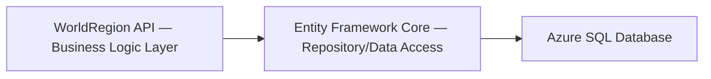

[JetFolio](../../../README.md) \ [docs](../../README.md) \ [Architecture Specifications](../README.md) \ [API](README.md) \

# World Region API & Data Persistence

The World Region API is the central business logic layer for managing world regions based on the United Nations M49 standard. It supports CRUD operations, bulk processing, and soft deletion while ensuring data integrity and scalability.

### Core Features

- World region management via structured API endpoints
- Transaction-safe database interactions
- Validation, logging, and security enforcement

### Components



---

## Service Layer Architecture

### Technology Stack

- **Backend Framework**: ASP.NET Core Web API
- **Data Access**: Entity Framework Core (EF Core)
- **Database**: Azure SQL Database
- **Authentication & Authorization**: Secure API with role-based access control

### Service Layer Components

- **API Endpoints**: Provides structured access to world region data.
- **Business Logic Layer**: Implements validations and transaction management.
- **Data Access Layer**: Handles database queries using EF Core.
- **Logging & Monitoring**: Captures errors, audits operations, and tracks performance.

---

## Data Model Specification

### World Region Entity

| Field Name     | Data Type | Description                  | Constraints / Notes                                       |
| -------------- | --------- | ---------------------------- | --------------------------------------------------------- |
| `RegionCode`   | string    | Unique UN M49 code           | Primary Key; Required                                     |
| `RegionName`   | string    | World region name            | Required                                                  |
| `ParentRegion` | string    | Parent world region          | Optional; if provided, must reference an existing record. |
| `Enabled`      | bool      | Status flag                  | Required; Defaults to true                                |
| `IsObsolete`   | bool      | Soft delete flag             | Defaults to false                                         |
| `CreateDate`   | DateTime  | Timestamp of record creation | Auto-managed                                              |
| `ModifiedDate` | DateTime  | Timestamp of last update     | Auto-managed                                              |

---

## Service Layer API Design

### Interface Definition

```c#
public interface IWorldRegionService
{
    Task CreateWorldRegion(WorldRegion region);
    Task<List<WorldRegion>> GetWorldRegions(bool includeObsolete = false);
    Task<WorldRegion> GetWorldRegionByCode(string regionCode);
    Task UpdateWorldRegion(string regionCode, WorldRegion updatedData);
    Task DeleteWorldRegion(string regionCode);
    Task BulkUploadWorldRegions(IEnumerable<WorldRegion> regions);
}
```

### API Endpoints

#### Create World Region

- **Method**: `POST /world-regions`

- **Request Body**:

  ```json
  {
    "RegionCode": "001",
    "RegionName": "World",
    "ParentRegion": null,
    "Enabled": true
  }
  ```

- **Response**:

  | Response          | Description                  |
  | ----------------- | ---------------------------- |
  | `201 Created`     | Region successfully created. |
  | `400 Bad Request` | Validation error             |

#### Retrieve List of World Regions

- **Method**: `GET /world-regions?includeObsolete=false`

- **Service Method**: `CreateWorldRegion(WorldRegion region)`

- **Response**

  ```json
  [
    {
      "RegionCode": "001",
      "RegionName": "World",
      "ParentRegion": null,
      "Enabled": true
    },
    {
      "RegionCode": "002",
      "RegionName": "Africa",
      "ParentRegion": "001",
      "Enabled": true
    }
  ]
  ```

- **Query Parameters**

  | Query Parameter                | Default Value | Description                                    |
  | ------------------------------ | ------------- | ---------------------------------------------- |
  | `includeObsolete=[true|false]` | `true`        | Indicates whether to include obsolete regions. |

#### Retrieve Specific World Region

- **Method**: `GET /world-regions/{regionCode}`

- **Service Method**: `GetWorldRegions(bool includeObsolete = false)`

- **Response**:

  | Response        | Description                     |
  | --------------- | ------------------------------- |
  | `200 OK`        | Returns the region details.     |
  | `404 Not Found` | The region code does not exist. |

#### Update World Region

- **Method**: `PUT /world-regions/{regionCode}`

- **Service Method**: `UpdateWorldRegion(string regionCode, WorldRegion updateData)`

- **Request Body**:

  ```json
  {
    "RegionName": "Updated Name",
    "ParentRegion": "001",
    "Enabled": false
  }
  ```

- **Response**:

  | Response          | Description                     |
  | ----------------- | ------------------------------- |
  | `204 No Content`  | Updated successfully.           |
  | `400 Bad Request` | Invalid data provided.          |
  | `404 Not Found`   | The region code does not exist. |

#### Delete World Region

- **Method**: `DELETE /world-regions/{regionCode}`

- **Service Method**: `DeleteWorldRegion(string regionCode)`

- **Response**:

  | Response        | Description                                                  |
  | --------------- | ------------------------------------------------------------ |
  | `200 OK`        | Region deleted (marked as obsolete).                         |
  | `404 Not Found` | The region does not exist (or is already marked as obsolete) |

#### Bulk Upload World Regions

- **Method**: `POST /world-regions/upload`

- **Service Method**: `BulkUploadWorldRegions(IEnumerable<WorldRegion> regions)`

- **Request Body**:

  ```json
  [
    {
      "RegionCode": "003",
      "RegionName": "Europe",
      "ParentRegion": "001",
      "Enabled": true
    },
    {
      "RegionCode": "004",
      "RegionName": "Asia",
      "ParentRegion": "001",
      "Enabled": true
    }
  ]
  ```

- **Response**:

  | Response          | Description                                        |
  | ----------------- | -------------------------------------------------- |
  | `200 OK`          | Bulk processing complete.                          |
  | `400 Bad Request` | Some records failed validation (details included). |

---

## Database Schema

```sql
CREATE TABLE WorldRegion (
    RegionCode VARCHAR(10) PRIMARY KEY,
    RegionName NVARCHAR(255) NOT NULL,
    ParentRegion VARCHAR(10) NULL,
    Enabled BIT NOT NULL,
    IsObsolete BIT NOT NULL DEFAULT 0,
    CreatedDate DATETIME DEFAULT GETDATE(),
    ModifiedDate DATETIME DEFAULT GETDATE()
);
```

### Indexes for Performance

- Index on `RegionCode` for fast lookups.
- Index on `IsObsolete` for efficient filtering.

---

## Logging, Security, and Performance

### Logging

- **Critical Actions**: Create, update, delete, and bulk upload are logged.
- **Error Handling**: API errors are logged with detailed diagnostics.

### Security

- **Authentication**: Secured API endpoints.
- **Role-based access control (RBAC)**; Restricts administrative operations.

### Performance Considerations

- **Async processing** for bulk operations.
- **Query optimizations** using indexed fields.

---

## Future Enhancements

- Multi-user support for non-admin access
- Internationalization for world region data
- Real-time updates via event-driven architecture

---

## Implemented User Stories

| User Story                                                   | Implemented Via                                              |
| ------------------------------------------------------------ | ------------------------------------------------------------ |
| [Admin CLI – Create New World Region](https://github.com/TaleLearnCode/JetFolio/issues/1) | [Create World Region](#create-world-region)                  |
| [Admin CLI – List All World Regions](https://github.com/TaleLearnCode/JetFolio/issues/2) | [Retrieve List of World Regions](#retrieve-list-of-world-regions) |
| [Admin CLI – Update World Region Details](https://github.com/TaleLearnCode/JetFolio/issues/3) | [Update World Region](#update-world-region)                  |
| [Admin CLI – Delete World Region](https://github.com/TaleLearnCode/JetFolio/issues/4) | [Delete World Region](#delete-world-region)                  |
| [Admin CLI – Retrieve World Region Details](https://github.com/TaleLearnCode/JetFolio/issues/5) | [Retrieve Specific World Region](#retrieve-specific-world-region) |
| [Admin CLI – Bulk Upload World Regions](https://github.com/TaleLearnCode/JetFolio/issues/6) | [Bulk Upload World Regions](#bulk-upload-world-regions)      |

---

## Version History

| Version | Date       | Author                                | Summary of Changes                                       |
| ------- | ---------- | ------------------------------------- | -------------------------------------------------------- |
| 0.1     | 2025-05-04 | [Chad Green](chadgreen@chadgreen.com) | Initial service layer and data persistence architecture. |

