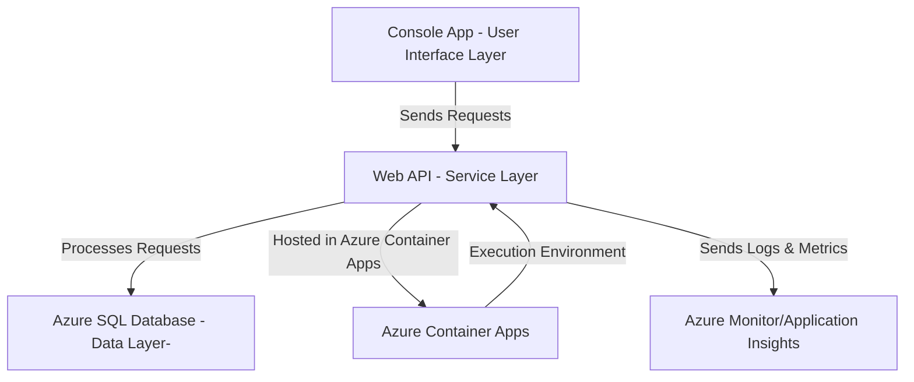
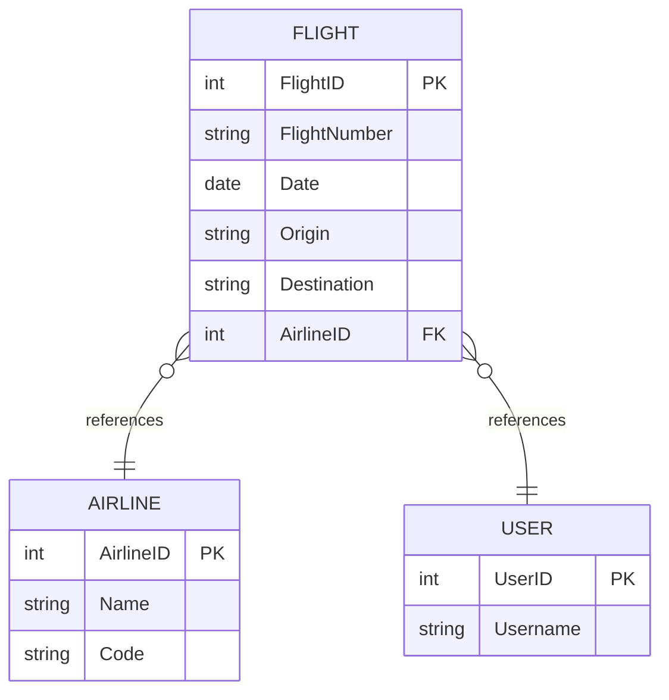

[JetFolio](..\README.md) \ [docs](README.md) \

# JetFolio Flight Plan Summary

> **In this document:**  
> [Overview](#overview)  
> [Components](#components)  
> [Event Interactions](#event-interactions)  
> [Process Flows](#process-flows)  
> [Data Management](#data-management)  
> [Public APIs](#public-apis)  
> [Monitoring and Logging](#monitoring-and-logging)  
> [Non-Functional Requirements](#non-functional-requirements)  
> [Assumptions and Risks](#assumptions-and-risks)  
> [Appendix A: Architecture Decision Records (ADRs)](#appendix-a:-architecture-decision-records-adrs)  
> [Appendix B: Glossary](#appendix-b:-glossary)

## Overview

JetFolio is a C# console-based flight tracking application designed to record and analyze airline travel details. It enables users to log flight information (such as flight number, origin/destination, airline, and dates) and provides insights like total miles flown, frequent routes, or airline usage patterns. The system's architecture follows a microservice-inspired, n-tier design: a lightweight console client interacts with a cloud-hosted Web API, which manages data persistence in an Azure SQL Database. This separation of concerns facilitates flexibility and scalability, allowing the user interface and backend to evolve independently. Key design principles include **loose coupling** (the console app and backend community only through well-defined APIs) and **single responsibility** (each component focuses on specific tasks, e.g., UI versus data storage). These principles help manage complexity and make the system easier to maintain and extend.

Specific constraints and trade-offs shaped the JetFolio architecture. For instance, using an **Azure SQL Database** (Platform as a Service) ensures high reliability and low maintenance for data storage, but it requires careful management of latency and costs. Similarly, adopting the **Entity Framework Core** ORM in a *database-first* approach accelerates development (by scaffolding models from an existing database) at the expense of some flexibility in code-first schema evolution. The system is deployed using **Azure Container Apps**, a fully managed serverless container environment. This decision offloads infrastructure management to Azure and provides built-in capabilities like automated scaling, ingress management, and environment isolation. However, it also meant ensuring the application can run seamlessly in a container and managing containerization during development. Throughout the design, trade-offs were made to favor **simplicity and clarity** over premature optimization. For example, the initial implementation uses a single Web API service rather than multiple microservices, simplifying deployment and communication. Importantly, the architecture leaves room for future enhancements: additional front-end clients (e.g., a web or mobile app) can be added by consuming the same Web API, and more sophisticated analytics or integrations (like real-time flight status data or event-driven processing) can be incorporated without fundamental changes to existing components. In summary, this overview sets the stage for JetFolio's architecture—a modular, service-oriented system built with cloud-native technologies to meet current requirements while being adaptable for future growth.

---

## Components




### JetFolio Console Application (Client)

The JetFolio console app is the front-end interface where users input and retrieve flight data. Running as a C# console program, it provides a text-based user experience to record new flights, list past flights, and display analysis results. The console app contains minimal logic — it mainly formats user commands and outputs, delegating all heavy lifting to the backend API. When a user enters a command (for example, to add a flight), the console app composes an HTTP request to the JetFolio Web API and displays the response or result. This design ensures the client remains thin and easy to replace or supplement (e.g., one could later introduce a GUI or mobile app using the same API endpoints). The console is essentially a **client layer**, handling user interaction and involving remote services.

###  JetFolio Web API (Service)

The system's core is an ASP.NET Core Web API application that implements JetFolio's business logic and data access. This Web API is packaged into a Docker container and deployed to **Azure Container Apps**, a serverless hosting platform. The Web API exposes a set of RESTful endpoints (e.g., to create a flight record, retrieve all flights, query statistics) over HTTPS. It authenticates and validates requests (in the MVP version, it might use basic authentication or API keys, with potential to integrate Azure AD in the future) and then processes them. The API uses **Entity Framework Core (EF Core)** for data operations to interact with the Azure SQL database. EF Core is an object-relational mapper, allowing the code to work with data as .NET objects rather than raw SQL queries. The project follows a database-first approach: the database schema is the source of truth, and EF Core models are generated to match it. Within the Web API, there may be internal layers (for maintainability): for example, Controllers handle HTTP requests and responses, a Service or Domain layer enforces business rules (such as avoiding duplicate entries or calculating derived metrics), and a Data Access layer (EF Core's `DbContext`) manages queries and transactions. The Web API is designed to be stateless — each request is independent, which aligns with the **serverless container** deployment that can scale out multiple instances as needed. Azure Container Apps provides features like *managed ingress*, *service discovery*, and *autoscaling*, meaning the JetFolio API can automatically receive traffic via an HTTPS endpoint and scale from zero to many replicas based on demand. This componentization ensures that the backend logic is encapsulated in a service that can evolve separately (e.g., update database logic without changing the client) and can be reused by other consumers beyond the console app.

### Azure SQL Database (Database)

JetFolio uses Azure SQL Database as its persistent data store. This is a fully managed cloud relational database service, meaning it is highly available, and Azure handles backups and patching. The database schema likely includes tables such as **Flights** (recording details like flight number, airline, origin, destination, date, duration, or distance, etc.). It could reference tables like **Airlines** or **Airports** if needed for normalization. The data volume (a user's personal flight history or a small group's records) is relatively modest in this initial scope. Hence, a single relational database is sufficient for storage and ACID-compliant transactions. The database-first approach implies that any schema changes are done via database migrations or scripts, after which EF Core can update its model classes. The advantage of a relational model here is the ability to use SQL for complex queries (e.g., aggregating total miles by airline) and ensuring data integrity (through relationships and constraints). The Azure SQL instance is configured with appropriate performance tiers to handle the expected workload. If usage grows, it can be scaled up or out (using elastic pools or higher service tiers). Being on Azure, it benefits from built-in reliability features—data is replicated, and the service promises 99.99% uptime, reducing the risk of data unavailability. Secure connectivity is established so only the JetFolio Web API (running in Azure) can access the database, typically using managed identities or secure connection strings (stored in Azure Key Vault or Container Apps secrets). This database component ensures that all flight records and related data are safely persisted between sessions and can be queried efficiently.

### Supporting Services and Infrastructure

In addition to the primary components above, the architecture includes supporting elements to complete the system. For example, **Azure Container Registry (ACR)** will store the Docker image for the JetFolio Web API, enabling the deployment to Azure Container Apps. The container app environment provides an execution context that includes networking, logging, and scaling for the Web API. The Web API container is deployed into an Azure Container Apps Environment, which groups container apps and can attach to a Log Analytics workspace for centralized logging of all containers. We also have **Application Insights** and Azure Monitor (detailed later) to monitor the Web API performance and errors. While not separate "components" per se, it is worth noting that the JetFolio Web API leverages frameworks like **ASP.NET Core** (for web service functionality) and **EF Core** (for ORM), which are internal components providing structure (for instance, EF Core's change tracking and LINQ support simplify data management). If required by future features, an **Azure Service Bus** might be introduced to enable asynchronous processing or integration events. JetFolio's event-driven needs are limited and can be handled within a single service instance or simple background tasks. The diagram below illustrates the main components and their interactions in JetFolio's architecture. It shows how the console client, web API, and database relate within the Azure cloud environment (with monitoring and other Azure services surrounding them for support).

---

## Event Interactions

JetFolio's architecture incorporates event-driven interactions to handle specific actions asynchronously and decouple system parts for better scalability. While the initial design is relatively simple (one client and one service), we have identified key **events** and utilized an event-driven approach internally for extensibility. At its core, the console application triggering an API call can be considered an event — for example, "*NewFlightRecorded*" is an event implied when a user adds a flight. Upon processing this request, the Web API might raise domain events or integration events within the system. **Domain events** are used in the business logic layer. When a flight record is added to the database, JetFolio can create an event object (e.g., `FlightAddedEvent`) and use C# events or a mediator pattern to notify other application parts that may need to react. For instance, there could be an event handler to immediately calculate updated statistics (total flight counts or miles accumulated) when a new flight is inserted, rather than waiting for a separate request. This event-driven programming within the API improves modularity—the code that sends a confirmation email or updates a summary dashboard can subscribe to the flight-added events without being directly invoked by the controller logic.

For broader, cross-component events (especially future interactions), JetFolio can utilize an **integration events** model standard in microservices. In this model, the Web API (as an event **producer**) would publish a message to a message broker like Azure Service Bus whenever something notable happens, such as a new flight entry or an updated flight record. These events are published in a **publish-subscribe** fashion, meaning any number of event **consumers** can listen without the producer needing to know about them., In the current system, we might not have multiple microservices. However, we can still set up an event consumer component—for example, a backend process (perhaps an Azure Function or a worker container) that subscribes to *FlightAdded* events. This consumer could send a notification email ("Your flight has been logged in JetFolio") or write an entry to a separate analytics store. By using a pub/sub event bus, JetFolio ensures these operations are done asynchronously and do not slow down the primary user-facing API response. If the user adds a flight, the API immediately returns confirmation while event handlers carry additional processing in the background.

Concretely, JetFolio uses Azure technologies to manage these event interactions. If using **Azure Service Bus Topics**, the Web API would have a client library to publish a message to a topic (e.g., "FlightEvents"), and a subscriber could be configured on the same topic for any event processing service enabled. Azure Service Bus guarantees the reliable delivery of these messages and supports the pub/sub model needed. For internal events within the Web API process, JetFolio relies on  .NET's event mechanism or a library like **MediatR** for in-process publish/subscribe of events, ensuring that components like the analytics calculator or logging module are loosely coupled from the request handling code. This architecture means adding a new event consumer (a future microservice that tracks user metrics whenever a flight is added) would not require changes to the existing Web API, except subscribing to the event bus.

The overall **Event lifecycle** in JetFolio can be described as follows (and is typically illustrated in a sequence diagram): The event *source* is often a user action via the console (e.g., "Add Flight"). The console's request to the API results in a state change (a new DB entry), which triggers an event generation in the API. This event is published to an event channel (in-process or via Service Bus). Event *processing mechanisms* then catch this event — for example, an in-memory handler updates a statistics cache, or an external subscriber picks up the message from the Service Bus queue. The *event consumers* perform their tasks (e.g., send email, update secondary indexes), possibly emitting further events if needed (though JetFolio's scope is small, so a simple chain is enough). Finally, the event lifecycle ends when all subscribed handlers have completed their work or the event expires without subscribers. We have chosen technologies that suit this pattern: **Azure Service Bus** for robust pub/sub, and the **.NET event system** for internal notifications. This hybrid approach ensures JetFolio responds to key activities in near real-time without tightly coupling all system parts. It also improves performance under load, as heavy tasks can be deferred and will not block user interactions. In summary, while JetFolio's event-driven elements are modest, the architecture is laid out to leverage events wherever they add reliability or scalability, making the system reactive and extensible.

---

## Process Flows

JetFolio implements several distinct process flows to accomplish its operations. Each process flow is a sequence of steps that data or control passes through from initiation to completion. These flows are documented here with accompanying diagrams to clearly show how data moves through the system and how different components interact.

### Flight Record Creation Flow

This flow covers how a new flight entry is added to the system. It begins with the user using the console application.

- **Step 1**: The user selects an option (or types a command) to add a new flight and enters the details when prompted (for example, airline name, flight number, origin, destination, date, etc.).
- **Step 2**: The console application formats this input into an HTTP **POST** request to the `flights` endpoint of the JetFolio Web API, including the flight details in JSON format in the request body. It then sends this request over the network.
- **Step 3**: Upon reaching the JetFolio Web API (hosted in Azure Container Apps), the appropriate controller (e.g., `FlightsController`) receives the request. The controller performs input validation (ensuring required fields are present and correctly formatted) and then calls the domain service or business logic layer to process the addition.
- **Step 4**: The business logic (within the Web API) creates a new Flight entry object. It may perform additional checks or enrichment (for instance, calculating the distance between origin and destination if that is within scope, or looking up a standardized airline code).
- **Step 5**: The Web API uses **Entity Framework Core** to add this new Flight entity to the database context and commits the changes. EF Core translates this operation into an SQL `INSERT` statement, which is executed against the Azure SQL Database. If a primary key (`FlightID`) is not provided, the database assigns one and saves the record. This database transaction is handled within a save operation, ensuring atomicity.
- **Step 6**: The Web API responds after a successful database save. Typically, it returns a success (HTTP 201 Created) and the newly created resources (perhaps the flight record with its ID). As discussed in the event interactions section, an internal event (`FlightAddedEvent`) may also be raised for post-commit actions.
- **Step 7**: The console application receives the HTTP response. It parses the result and then displays a confirmation to the user, such as "Flight AA123 FROM NYC to LA on 2024-05-01 has been recorded successfully." This completes the flow, giving the user feedback that their data has been stored.

Throughout this flow, if any step fails (e.g., network error, validation fails, or database error), appropriate error handling is in place. The API would return an error status (like 400 Bad Request for validation issues or 500 Internal Server Error if something unexpected occurred), and the console app would display an error message. The successful flow, as described, ensures data integrity (only saved if valid) and informs the user accordingly.

### Flight Data Retrieval (List) Flow

A common operation is listing all recorded flights or querying specific flights. This process flow outlines how the system retrieves and returns data to the user.

- **Step 1**: The user chooses an option on the console (for example, "List all my flights" or a filtered query like "Show flights in 2023"). The console app sends an HTTP **GET** request to the appropriate API endpoints, such as `GET flights` or `GET flights?year=2023` (for a filtered list). This request is sent to the Web API.
- **Step 2**: The JetFolio Web API receives the GET request in the `FlightsController`. An unfiltered list might directly query the repository/EF Core for all flight records; for a filtered list, it applies query parameters (like a `WHERE Year(DATE) = 2023` clause).
- **Step 3**: The Web API uses EF Core's querying capabilities (LINQ to Entities) to retrieve the data from Azure SQL. EF translates the LINQ query into SQL (`SELECT * FROM Flights ...`) and executes it. Given potentially many records, the API may impose limits (pagination) and/or ordering by date.
- **Step 4**: The data is materialized into a list of Flight objects. Before returning, the API might shape the data, for example, by omitting any sensitive fields or joining them with related data (if there were separate tables for airlines or airports, EF could include them). Suppose each Flight has an AirlineId. The API might join the Airlines tables to include the airline name in the response. This is done through EF's navigation properties or explicit joins.
- **Step 5**: The API returns an HTTP 200 OK response with a JSON array of flight records. Each record could include fields like FlightId, FlightNumber, Airline, Origin, Destination, Date, etc. The payload is structured and human-readable (JSON keys are descriptive).
- **Step 6**: The console application receives this data. It then formats the list for display. For instance, it might tabulate the output showing each flight on a new line with its details or enumerate them. It ensures a blank line separating the list from the next console prompt for readability.
- **Step 7**: The user sees the list of flights on the console. If the list is long, the application might paginate the output to summarize (perhaps showing total count). The flow ends here with the user informed of the requested data.

This retrieval flow demonstrates the **read** path in the system, which is optimized for performance. It uses direct database reads and indexes on the Azure SQL side (for example, an index on Date or Airline if those are commonly filtered). The process ensures only minimal processing in the API (mostly just data shaping) and leverages the database for heavy lifting. Caching could be introduced to speed up frequent queries if needed, but consistency (always fresh data) is initially prioritized.

### Flight Statistics Analysis Flow

One of JetFolio's primary features is analyzing the logged flight data. This might include computing total miles flown, the number of flights per airline, or other statistics. This flow can be on-demand (triggered by user request) or event-driven (updated whenever data changes). We'll describe an on-demand report generation that the user triggers from the console.

- **Step 1**: The user selects "View Travel Summary" in the console app. The console then issues an HTTP **GET** request to `analytics/summary` (for example).

- **Step 2**: The Web API's AnalyticsController (or similar) handles the request. In the simplest case, it will gather data from the Flights table to compute the needed statistics. This could involve multiple queries or a single aggregate query. For instance, it might execute a SQL query to sum up distances or counts grouped by airline.

- **Step 3**: The API uses EF Core to perform these aggregations. EF Core can translate LINQ aggregate functions into SQL (e.g., `SELECT Airline, COUNT(*) as FlightCount FROM Flights GROUP BY Airline`). Alternatively, a stored procedure or SQL view could be utilized for complex calculations. Suppose JetFolio tracks distance; the query would sum the distance column to get total miles. If distance is not stored, perhaps the API calculates distances on the fly via an algorithm (which would be less efficient per call).

- **Step 4**: The results of these computations (say, a list of airlines with flight counts and a total of flights and total miles) are assembled into a response object. The API might define a Summary DTO (Data Transfer Object) containing fields like `TotalFlights`, `TotalMiles`, `TopAirline`, etc., and populate it from the query results.

- **Step 5**: The API returns an HTTP 200 response with this summary data in JSON. For example:

  ```json
  {
      "totalFlights": 15,
      "totalMiles": 35000,
      "flightsByAirline": [
          {
              "airline": "Delta",
              "count": 5
          },
          {
              "airline": "United",
              "count": 4
          }
      ]
  }
  ```

- **Step 6**: The console app receives this and prints a human-friendly summary. It may iterate through the `flightsByAirline` list, print each airline and count, and then print the total flights and miles. Proper formatting and blank lines are used to make the output readable.

- **Step 7**: The user views the summary on the console. This helps them quickly glean insights from their travel history. The flow concludes after displaying the analysis.

This analysis flow shows how JetFolio processes more complex operations. Such computations should be reasonably fast to keep the user's experience smooth. Azure SQL can handle aggregation on moderate dataset sizes well. Still, if data grows, a future enhancement might be maintaining a running summary (updated by events when flights are added) to avoid heavy computation on demand. In the current design, correctness and simplicity were favored: the data is always derived fresh from the source of truth in the database, ensuring accuracy.

Alternatively, flows exist for update and deletion operations (if JetFolio allows editing flight entries or removing them). For an update, the flow would mirror the creation: the user triggers an update command, and HTTP **PUT**/**PATCH** is sent to `flights/{id}`, the API validates and updates the record in the database, and returns success with possibly the updated object. Deletes would be a **DELETE** request, and the API would remove the record (likely marking it as deleted or removing it outright), and then the console confirms the deletion. Each of these flows is carefully handled to maintain data consistency. For example, the API might prevent deletion if the flight is part of some summary that cannot easily be reconciled. Logging is done at each step for traceability (e.g., the API logs every create/update/delete).

All process flows benefit from the **event interactions** mentioned earlier. In the create/update/delete flows, after the DB operation, internal events can trigger recalculation of stats or clearing of caches; in the retrieval flows, events are less needed, but monitoring events (like a log event for each query) are emitted. The combination of these flows and events defines JetFolio's runtime behavior, ensuring that, from a user's perspective, each action reliably and efficiently leads to the expected outcome.

---

## Data Management

Data management in JetFolio covers how data is **stored, modeled, accessed, and updated** throughout the system, along with the relationships between data entities and how data flows from ingestion to persistence. The backbone of JetFolio's data management is the **Azure SQL Database**, which holds all persistent data. The schema has been designed (or, in a database-first scenario, assumed) to capture the key information about flights and related entities in a normalized, relational format.

### Data Modeling

The primary entity in JetFolio is the **Flight** record. A Flight table might have columns such as `FlightId` (primary key), `Airline` (or `AirlineId` if normalized to an Airlines table), `FlightNumber`, `Origin`, `Destination`, `DepartureDate` (and possibly `ReturnDate` if round trips are considered), `Distance` or flight duration, and `Notes`. If the design is enriched, separate tables like Airline (`AirlineId`, `Name`, `Code`) or Airport (`AirportCode`, `City`, `Country`) could avoid duplication and allow easy updates to the reference data. Given the scope, JetFolio could keep it simple with text fields for the airline and airports. The relationships in the data model are straightforward: if reference tables are used, a flight has a foreign key to an airline. This means an airline can have many flights (1-to-many relationship). Similarly, if user profiles were introduced, a User could have many flights linked (but currently, it might be a single user, so tracking might not be in the schema). The data model ensures **referential integrity** — for example, if using an `AirlineId` in Flight, the database is set to ensure that the `AirlineId` must exist in the Airline table (foreign key constraint). This prevents orphan references and keeps the database consistent.

**Entity Framework Core (EF Core)** represents this data model in the application layer. Using EF Core's database-first approach, the actual classes (Flight, Airline, etc.) might be generated to mirror the database schema. Each property in the class corresponds to a column in the table, and relationships (like Flight to Airline) are represented with navigation properties. This benefit is twofold: developers can work with data in a more natural object-oriented way (without writing SQL for every operation), and EF Core handles mapping those operations to SQL behind the scenes. For example, adding a new Flight object to the context and calling `SaveChanges ()` results in an `INSERT` statement; querying flights with a LINQ filter results in a `SELECT` with a `WHERE` clause. EF Core also provides **change tracking** (to detect what has changed in an object and only update those fields) and can manage relationships (like if you attach an Airline object to a Flight, it will ensure the right foreign key is set).

> [!IMPORTANT]
>
> It is highly recommended that the model classes be written by hand instead of using the built-in database-first scaffolding mechanisms within EF Core. The scaffolder tends to produce relationship names that do not make sense when trying to read the code using them.

### Data Ingestion and Processing

Data entries are primarily entered into the system through the console input into the Web API. When a user adds or updates data, the API processes it (validation and business rules) and then writes to the database via EF Core. This ingestion path is synchronous in the initial design, meaning the API call will only return after the data is successfully persisted. This ensures the user gets immediate feedback that their data is saved and guarantees consistency (if the API returns success, the data is definitely in the database). The architecture could be ingested via background jobs or event-driven pipelines in scenarios where data might come from external sources (for instance, if JetFolio were later extended to import flights from an email or another service). Azure services like Azure Data Factory or Logic Apps could bring in data batches (e.g., import a CSV of flights). The Web API or a dedicated importer would process those into the same database. Regardless of the source, all roads lead to the Azure SQL database, maintaining a single source of truth.

Once ingested, the data is processed as needed for output. For example, when the user requests analytics, the raw flight records are processed (summed, counted) by querying via SQL or retrieving them into memory and using LINQ. When listing flights, minimal processing is needed — perhaps sorting by date and formatting. The heavy lifting of data management (storing, indexing, and retrieving efficiently) is delegated to Azure SQL, which is optimized for such operations. The database likely has indexes on key columns like `DepartureDate` (for date range queries) or `Airline` (if filtering by airline often). By default, the primary key `FlightId` will have an index. If JetFolio has many records, such indexes ensure queries remain fast. The database can also enforce constraints such as uniqueness (e.g., if we wanted to ensure no duplicate exact flight entries, a composite unique key on `[FlightNumber, Date]` might be used — though likely note, as a flight number can repeat on different dates.)

### Data Persistence

The persistence is handled by EF Core, which is called `SaveChanges()`, which wraps operations in a transaction. This means if a new flight is added and simultaneously an airline record needs to be added (in a normalized scenario), EF can execute both insert statements under one transaction, so either both succeed or both fail, preserving consistency. Azure SQL's transaction support and consistency guarantees (an ACID-compliant database) align well with this approach. EF Core also supports **migration** to update the database schema in a controlled way, although with database-first, migrations might be done via scaffolding or manual scripts. In any case, changes to the data model go through a careful migration process with backup considerations, as one of the assumptions is that data (someone's flight history) should not be lost.

### Data Flows (End-to-End)

Summarizing an end-to-end data flow: when a user enters data (ingestion) through the console, it flows to the Web API, which processes and then persists it in Azure SQL. This is the **write flow**. Then, when the user or an external consumer requests data (a **read flow**), the request goes to the API, which pulls from Azure SQL and sends the data out. JetFolio might also have internal flows between these flows, such as an event causing a cached statistic to update (where the data flow is from DB to memory cache, for instance). Currently, the architecture keeps it simple by not introducing separate caches or data warehouses — the transactional DB is used for both operational and analytic queries (suitable given the scale). If usage grows, a read replica or a separate reporting database could be introduced to handle heavy analytical queries without affecting transactional performance.

### Data Management Security

Security in data management is critical: the Azure SQL database is secured so that only the Web API (with proper credentials) can access it. The connection string for the database is stored securely (likely as a secret in the Azure Container App or Azure Key Vault) so that it is not exposed. Communications between the API and SQL are encrypted (SSL/TLS) to protect data in transit. Furthermore, sensitive data considerations (for instance, if JetFolio stored personal user info or sensitive travel details) would require encryption or masking at rest. Azure SQL supports transparent data encryption by default (encrypting the database file on disk) and implements data masking if needed for specific fields.

### Summary

In summary, JetFolio's data management approach leverages a robust relational database for storage and an ORM for data access. The design ensures consistency (through ACID transactions), ease of use from a developer standpoint (EF Core abstraction), and performance through indexing and efficient querying. Data relationships and flows are clearly defined so that every piece of information has a controlled lifecycle from creation to persistence to retrieval, with no important detail falling through the cracks or being handled in an ad-hoc manner.



---

## Public APIs

JetFolio exposes a collection of public RESTful APIs through its ASP.NET Core Web API service. These APIs allow external consumers — including the JetFolio console application and potentially other applications or services — to interact with the system. Each API endpoint is carefully designed with clear methods, resource URLs, and expected inputs/outputs, adhering to REST principles for intuitive use. Below is a list of initially conceived key publicly exposed API endpoints, including their HTTP methods, paths, and a brief description of their purpose.

> [!NOTE]
>
> Each endpoint will have a detailed specification in the API documentation, which can be referenced separately for exact request/response schemas and error codes.

| Name                            | Endpoint                          | Description                                                  |
| ------------------------------- | --------------------------------- | ------------------------------------------------------------ |
| **List Flights**                | `GET /flights`                    | Retrieves all flight records in the system (or optionally can be filtered by query parameters such as date range or airline). This allows consumers to fetch the logged flights. For example, the console app uses this to display the user's flight history. The response is a JSON array of flight objects. Pagination parameters (e.g., `?page=&size=50`) might be supported if the dataset is large, to limit results per request. |
| **Get Flight Details**          | `GET /flights/{id}`               | Retrieves a specific slight record by its unique identifier. If it exists, this returns a JSON object with full details of the flight `{id}`. This could be used if a user wants to view or edit a specific entry. If the `{id}` is not found, a 404 Not Found is returned. |
| **Create Flight**               | `POST /flights`                   | Adds a new flight record. The client provides flight details in the request body (JSON format). On success, the API returns HTTP 201 Created with the created flight response (including its new identifier). This endpoint is used when the console app records a new flight. It validates input and may reject requests with missing or invalid data (returning 400 Bad Request). It also sets the `Location` header in the response to the URL of the new resource (following RESTful conventions). |
| **Update Flight**               | `PUT /flights/{id}`               | Updates an existing flight record identified by `{id}`. The request body contains the updated flight data. This is used to correct or change details of a recorded flight. The API will apply the changes to the corresponding record in the database. A whole flight object is typically supplied; if the record does not exist, the API will return 404. A successful update returns 204 No Content, indicating the flight was updated. |
| **Delete Flight**               | `DELETE /flights/{id}`            | Removes a flight record from the system. This allows users to delete entries (for example, if a flight was logged by mistake). On success, a 200 OK is returned (meaning the deletion happened). If the record does not exist, a 404 is returned. The implementation ensures that any associated data (if any, like references) are handled, or the deletion is blocked if it would break referential integrity. |
| **Get Summary Stats**           | `GET /analytics/summary`          | Provides aggregated travel statistics, such as total number of flights, total distance, breakdown by airline, etc., as discussed in the Process Flows. This returns a JSON object containing the summary. It is used whenever the console app requests an overview of the user's travel data. This endpoint encapsulates the analysis logic so external apps do not need to compute it, ensuring consistency in calculating statistics. |
| **Flights per Year Chart Data** | `GET /analytics/flights-per-year` | Returns data useful for plotting or listing the number of flights per year. This could return a list of year and flight count pairs. External tools or a UI could consume this to display trends over time. It demonstrates how specialized queries are exposed via the API for consumption. |

All the above APIs are versioned under perhaps a v1 (sometimes endpoints are prefixed with `/v1/...` to allow version evolution). They communicate using standard HTTP response codes and JSON payloads, providing a predictable interface. JetFolio provides an **OpenAPI/Swagger** definition for integration and testing that documents each endpoint's request schema, response schema, and error cases. External developers (or even the console app developer) can refer to this documentation or the interactive Swagger UI to understand how to call the APIs and what to expect.

Each endpoint ensures idempotency where appropriate — for example, calling `DELETE /flights/123` twice will result in the second call returning a 404 (since the first call already deleted the flight), but it will not corrupt the system. Security for these public APIs is handled via authentication (in a simple scenario, perhaps an API key or token must be included in calls — the specifics would be detailed in the API specification document for each endpoint). Without proper credentials, the API would return 401 Unauthorized or 403 Forbidden. This prevents unauthorized data access.

The **purpose** of exposing these APIs is to enable integration. The JetFolio console app is an API consumer, demonstrating how a client can use the endpoints to implement the user-facing functionality. Moreover, if someday JetFolio offers a web interface or users want to expose their data, these same APIs can be consumed in those contexts. The consistency of using HTTP and REST means any programming language or platform that can make web requests can interface with JetFolio easily.

For detailed specifications of each API (including sample requests, example responses, error codes, and edge-case behaviors), refer to the *JetFolio API Reference* for documents or the Swagger UI provided with the deployment. Each endpoint's detailed spec includes field data types, required versus optional fields, maximum lengths (for strings like airline name), etc., ensuring that integration is straightforward for developers and that the API is used correctly. By documenting and adhering to these API contracts, JetFolio ensures external interactions are robust and the service can be integrated into other tools or ecosystems with minimal friction.

---

## Monitoring and Logging

Monitoring and logging are crucial for maintaining the health, performance, and security of the JetFolio application in production. JetFolio leverages Azure's cloud-native monitoring tools alongside built-in logging frameworks in .NET to achieve comprehensive observability. The goal is to detect issues early, diagnose problems quickly, and gather insights into usage patterns and system performance, all while ensuring security events are tracked.

### Application Logging

Within the JetFolio Web API, the built-in ASP.NET Core logging framework is used (which supports providers like Console, Debug, and integrations with Azure). Key events are logged at appropriate levels — for example, informational logs for each API request (including method, URL, and response statuses), warning logs for unusual but handled situations (like a request for a flight that does not exist), and error logs for exceptions or failures. Sensitive information (like personal data or passwords, if any) is never logged to maintain security. These logs from the application are configured to be sent to **Azure Application Insights** and Azure Log Analytics. Application Insights is an Application Performance Management (APM) service that collects telemetry from the live application, such as request logs, exceptions, dependency calls (like database queries), and custom events. By integrating Application Insights SDK into the Web API, JetFolio automatically tracks incoming requests and their execution times, error rates, and more. For instance, every call to `GET /flights` is recorded with its duration and outcome, enabling us to track if any particular request is slow or failing frequently.

### Infrastructure and Container Logging

Azure Container Apps emits logs about the container lifecycle and resource utilization. We configure the Container App environment to send logs to an **Azure Log Analytics Workspace**. All container stdout/stderr (which would include our application logs, since ASP.NET Core by default logs to stdout in containers) are aggregated there. This central log store allows running queries (using Kusto Query Language) to filter and analyze logs. For example, an operator can query all error logs in the last 24 hours or count how many times each endpoint was called. Container Apps also provide metrics such as CPU usage, memory usage, and instance count. Those metrics are essential for monitoring performance and scalability — if CPU usage is consistently high, it might indicate the need to scale out or optimize code.

### Health Monitoring

JetFolio implements health check endpoints (like a `GET /health` endpoint), which the Azure infrastructure can ping to ensure the Web API is responsive. Azure Container Apps can be set up with liveness and readiness probes. A readiness probe might call a lightweight endpoint to confirm the app can serve requests (perhaps checking database connectivity).  A liveness probe ensures a hung application gets restarted automatically by the container orchestrator. If a probe fails, Container Apps will restart the container or remove it from rotation, ensuring the user (console app) does not keep sending requests to a non-responsive instance.

We use Azure Monitor to define **alerts** on top of logs and metrics. For example, an alert is configured if the Web API's error rate exceeds a certain threshold (say more than 5% of requests failing) or if the CPU for the container stays above 80% for more than 5 minutes. These alerts are sent to notify the development/DevOps team via email or other channels. This way, even outside of active monitoring, the team will be promptly alerted to potential problems and can address them before they impact users severely.

### Performance Monitoring

As noted, Application Insights collects performance data. We will set up Application Insights to track the duration of key operations and identify dependencies like SQL queries. The Application Insights dashboard shows metrics like average response time per API endpoint or the slowest database queries. We can also use the Application Insights *Availability* feature, which can periodically send test requests to our API (from various regions) to ensure it is up and measure responsiveness. This way, we confirm that JetFolio is not just running but also reachable globally with good performance. If an endpoint becomes slow (perhaps a query needs an index), we will catch it via these metrics and trace it to the specific call or query causing the slowdown.

### Security Monitoring

All authentication and authorization events are logged. For instance, any failed login or invalid token usage is logged at warning level (to watch for suspicious activity). Azure Monitor can be used to set up alerts for multiple failed login attempts (possibly a brute-force attack) or unusual patterns (like a single token trying to access hundreds of resources rapidly). If JetFolio is integrated with Entra ID for authorization, Entra ID will provide logs of sign-in attempts that can be monitored. Additionally, we ensure that any changes to the infrastructure (like scaling events, configuration changes in Container Apps) are logged. Azure Resource Manager activity logs capture who deployed a new version or changed a setting, which is important for auditing and troubleshooting configuration-related issues.

### Tools and Frameworks Summary

We primarily use **Azure Monitor** (which encompasses Application Insights and Log Analytics) as our monitoring backbone. In code, the **Application Insights SDK** is the framework that instruments the app. The ASP.NET Core logging abstraction with an **Ilogger** interface is used in code, which Azure logging providers configure so that those logs can also be written to the console or files. Still, the Azure pipeline is used in production. Application Insights automatically handles correlation of requests and database calls. For example, if a request fails due to a SQL error, it can correlate the exception with the specific SQL call that triggered it, which is extremely useful for debugging.

### Alerting Mechanisms

As mentioned, alerts are configured on metrics like error rate, response time, and resource usage. Azure Monitor can also detect anomalies (using smart detection) in metrics such as request rate or failure rate and alert if someone deviates from the norm significantly. Logs are periodically reviewed (or dashboards set up) for warning signs such as increasing latency or growing database execution times.

### Summary

In conclusion, JetFolio's monitoring and logging setup provides complete visibility into the system's operation. Using logged correlation identifiers, we can trace a user action from the console through the Web API into the database and back, and see how long each step took and where any failure occurred. We can observe usage trends (for example, if usage spikes due to more users or frequent use, we see that in the metric and can proactively scale up). All these practices align JetFolio with the Azure Well-Architected Framework's principles for operational excellence, ensuring the system remains healthy, performant, and secure over time.

---

## Non-Functional Requirements

In addition to its functional capabilities, JetFolio has a set of **Non-Functional Requirements (NFRs)** that are crucial to its success. These define the quality attributes and overall system constraints that JetFolio must satisfy. Below, we highlight the critical non-functional aspects and the criteria or benchmarks JetFolio aims to meet for each.

### Performance

JetFolio should respond quickly to user actions. Most API calls (such as retrieving a list of flights or adding a new flight) should execute within sub-second latency under typical loads. Specifically, our target is that 95% of API responses complete in under 500 milliseconds, with simpler GET requests often completing in less than 200 milliseconds. Being a local client, the console app adds negligible overhead, so perceived performance largely depends on API responsiveness and network latency. The system is designed with efficient queries and minimal bloat — e.g., using appropriate database indexes and returning only necessary data to avoid payload overhead. We also aim for the application to perform adequately with a growing data set. JetFolio should handle up to 10,000 flight records without significantly degrading query times. We will test the analytics queries on such volumes to ensure they are within acceptable limits ( a few hundred milliseconds).

### Scalability

The architecture is built to scale both **vertically** and **horizontally**. Azure SQL can be scaled vertically to a higher tier to handle more transactions per second or larger data. Horizontally, the use of Azure Container Apps for the Web API means we can easily scale out additional instances of the API container to handle increased load, either manually or through auto-scaling rules.

### Reliability

Reliability means JetFolio remains available and consistent in the face of failures. We aim for high availability; using Azure's infrastructure gives a baseline (Azure SQL is 99.99% uptime, Container Apps aims for a similar high uptime). We further improve reliability by distributing the application across Azure's availability zones where possible (for example, Azure SQL can be configured with zone redundancy, and Container Apps by default abstract away VM failures by restarting containers). Key reliability measures include having automatic restarts for any failing container (the orchestrator will restart the Web API container if it crashes). The system is also designed to handle transient errors gracefully — for instance, if a database connection fails temporarily, EF Core (with built-in retry logic or using Polly for resilience) will retry a few times before giving up, which often smooths over brief network blips.

JetFolio has a **backup and recovery** plan: the Azure SQL database has automated backups (point-in-time restore enabled). In a worst-case scenario of data corruption or accidental deletion, we can restore the database to a previous point. The Recovery Point Objective (RPO) is on the order of minutes (i.e., backups or log shipping ensure we do not lose more than a few minutes of data). Recovery Time Objective (RTO) is minimal — a database restore or failover to a geo-redundant secondary can be done within an hour at most, likely much less. On the application tier, since containers are stateless, recovery just means redeploying or restarting containers, which is automated. In case of a regional outage in Azure, we can deploy JetFolio in a secondary region (restoring the DB backup there). Though manual, this provides a path to get running if an entire Azure region goes down (which is very rare).

Overall, our reliability objective is to have **uptime of at least 99.5 %**, meaning less than ~4 hours of downtime per month, which we expect to easily achieve with the above measures.

### Security

Security is paramount, as JetFolio will contain personal travel information. Several facets are addressed:

- **Authentication and Authorization**: The public API is secured. In a simple setup, this could be an API key required on requests, but ideally, we integrate with Entry ID or another identity provider to authenticate each request. Only authorized users (the data owner) can access or modify their flight records. We enforce authorization checks in the Web API—for example, if it is multi-user, one user cannot fetch or delete another user's flights.
- **Data Protection**: All communications with the Web API occur over HTTPS, preventing eavesdropping. The Azure SQL connection also uses encryption (SSL). Within Azure, the data at rest is encrypted by Azure SQL's Transparent Data Encryption (TDE) by default. We would consider additional encryption at the application level for those fields if we store sensitive personal data (like passport numbers, etc., which we currently do not).
- **Secrets Management**: Any credentials or secrets (like the DB connection string) are stored securely. In Azure Container Apps, secrets are stored in configuration, not in code or logs. Azure Key Vault may be used to manage these. Access to the secrets is limited and audited.
- **Vulnerability Management**: We update the application dependencies to patch security vulnerabilities (e.g., regular updates to NuGet packages and base container images). The container image is scanned (using services like Microsoft Defender for Cloud) for known vulnerabilities.
- **Security Logging and Auditing**: As mentioned in monitoring, security-related events are logged. We maintain an audit trail of important operations — for instance, any creation, update, or deletion of flight entries could be logged with who did it and when. This helps in accountability and tracing any unauthorized or unexpected changes.
- **Compliance and Standards**: JetFolio's security approach aligns with common standards. For instance, when handling user data, we align with GDPR principles by allowing data deletion (if a user requests, we can delete their data permanently) and not keeping data longer than needed. We also ensure **non-repudiation** and **accountability** by logging user actions (with timestamps and user identifiers).

### Maintainability

JetFolio is built with maintainability in mind. The codebase follows clean architecture practices — separation into layers (API controllers, services, data access) — which makes understanding and modifying code easier. We strive for clear naming, thorough documentation (comments in code and external docs for the architecture, which this document itself is part of), and use of standard frameworks to reduce complexity. Maintainability is measured by how quickly new team members can get productive or how safely we can implement a change. We maintain a suite of unit and integration tests to catch regressions, thereby improving maintainability by ensuring modifications do not break existing functionality. The system also supports maintainability through its modular design. Deployment is automated (via CI/CD pipelines with infrastructure as code using Terraform), which means maintaining or updating the production system is straightforward and less error-prone. Key maintainability metrics include: the time to diagnose and fix a bug (mean time to repair), which we aim to keep low through good logs and modular code; and the time to implement a new feature, which is improved by the clear separation of concerns and using familiar patterns. Moreover, because JetFolio uses widely known technologies (ASP.NET Core, EF Core, Azure services), it is easier to find developers to maintain it and to find community knowledge/solutions for any issues, rather than if it were a custom or obscure stack.

### Usability

Although the primary user interface is a console application (which might not be as user-friendly as a GUI), we will make it as usable as possible. Usability in this context refers to the ease with which users can accomplish tasks using JetFolio. We will ensure that the console app has clear prompts and confirmations. For example, after each action, a clear message is shown ("Flight added successfully!"). Command options are designed to be intuitive. Error messages are informative — if a user inputs invalid data, the app explains what went wrong ("Data format is invalid, please enter as YYYY-MM-DD"). Even though it is text-based, the flow is designed not to overwhelm the user with too much information at once. We follow console UI best practices like not clearing the screen unexpectedly, allowing the user to quit at any prompt, etc., to respect usability.

From an API usability perspective, we will design the REST API to be logical and consistent. Resource names and URLs follow industry norms; HTTP methods are used correctly (GET for retrieve, POST for create, etc., as listed above). This consistent adherence to standards makes the API more **usable** for developers who might integrate JetFolio into other tools. We also provide documentation (OpenAPI spec), significantly enhancing the developer experience.

Additionally, while not a direct user-facing attribute right now, **internationalization** could be considered in usability if we ever output messages in different languages or accept localized input., At present, we assume English for the interface, but design decisions (like not hard-coding messages and keeping them in a resource file) could ease translating the interface, contributing to usability for non-English speakers in the future.

### Compliance

JetFolio does not explicitly handle highly regulated data (like financial or health data). However, it still observes general compliance standards relevant to personal data (travel history can be considered personal data). We commit to the GDPR principles for any data we store. This means users have the right to request their data be deleted (JetFolio can comply by deleting their records from the DB and backups as needed) or exported (we could provide a feature to export all flights in CSV, for example). We ensure data is stored only as long as necessary. If JetFolio had a feature to auto-delete old data after a specific period, it could be configured for those who want it. On the infrastructure side, the Azure services we use comply with major standards (ISO 27001, SOC 2, etc.), so by building on Azure, we inherit a lot of compliance assurances. For instance, Azure SQL complies with GDPR, and we can cite that relevant data protection measures are in place (like data encryption).

### Other Non-Functional Aspects

There are a few more non-functional requirements worth mentioning:

- **Extensibility**: We will design the system to be extensible (closely related to maintainability). New features—like tracking hotel stays or car rentals in the future (if JetFolio expanded its scope)—could be added in parallel, possibly as additional endpoints or modules, without affecting the core flight tracking.
- **Portability**: The system uses .NET Core and containers, which are quite portable. We can deploy the container to run the JetFolio backend on Linux, Windows, Azure, or on-premises if needed, which is a plus if hosting needs change. The console application is portable and compatible with Windows, Linux, or macOS.
- **Testability** By separating logic, we can unit test the business logic without the web or database and integrate test the API with the database in a test environment. This ensures we meet quality goals and can refactor safely (which ties into maintainability).

### Summary

In summary, JetFolio's non-functional requirements ensure that, beyond just "working", the system works well in real-world conditions and meets stakeholder expectations for speed, safety, and reliability. We have established clear criteria (like response time targets, uptime percentages, and security measures). We will continually monitor and validate these (tying back to Monitoring & Logging) to ensure JetFolio remains a robust and user-friendly system.

---

## Assumptions and Risks

During the design and implementation of JetFolio, several assumptions are being made about the operating context and usage of the system. It is essential to document these assumptions because if any of them change or turn out to be incorrect, they could present risks to the project. Alongside each assumption, we identify potential risks and the mitigation strategies in place to manage those risks.

### Moderate Usage Volume

We assumed that JetFolio would be used by a relatively small number of users (single user initially) with a moderate number of flights recorded (on the order of hundreds or a few thousands, not millions). This assumption influenced decisions like using a single SQL database (instead of sharding or a big data solution) and not implementing complex caching.

- *Risk*: If usage exceeds expectations — for example, JetFolio gains popularity and thousands of users sign up, each logging extensive flight histories — the system might face performance or capacity issues. The database could become a bottleneck, or the API might need more aggressive scaling.
- *Mitigation*: The architecture is cloud-based and can scale (we can increase the DB tier and add more API instances). We also designed endpoints and queries with efficiency in mind. Additionally, we will have monitoring in place to alert us if load is saturating the system (CPU high, queries slow), giving us a chance to react (scale up or refactor) before it severely impacts users. We could consider partitioning data by user or introducing read replicas for heavy read scenarios if needed.

### Internet Connectivity and Cloud Access

It is assumed that users of JetFolio (and the console app) have reliable internet access to connect to the Azure-hosted Web API. The system is not designed for offline use.

- *Risk*: If a user is offline or Azure has a regional outage, the console app will not function (since it cannot reach the API). This could lead to user frustration or data backlog.
- *Mitigation*: While offline mode is out of scope, one mitigation is to ensure the console app does not hang indefinitely on failed requests — it should time out and inform the user that it cannot reach the server. On the server side, hosting in Azure provides high availability; for an Azure outage, our mitigation is having backup procedures (we can deploy in another region if needed). We communicate to users that an internet connection is required.

### Single Tenant / Single User Focus

The design often assumes one primary user or a small set of known users. For example, we will not be implementing a full multi-tenant security model or role-based access control beyond basic authentication.

- *Risk*: If JetFolio is offered as a multi-tenant service (e.g., different people sign up and each should only see their data), we would need to quickly implement a robust identity and permission system. Without it, there is a risk of data leakage between users (a serious security/privacy issue).
- *Mitigation*: We have laid the groundwork such that adding authentication is straightforward (ASP.NET Core Identity or JWT token auth can be integrated). The data model can accommodate a `UserId` on flights if needed. As a short-term mitigation, if a multi-user scenario arises suddenly, we could deploy separate instances for different users (not ideal, but a stop-gap to isolate data). Long-term, the plan would be to implement proper multi-user support. This is noted as a future enhancement. Until then, we minimize risk by perhaps only giving the software to trusted users in a controlled manner.

### Accuracy of User Input

We assume users will input flight data correctly (or mostly correctly), and the system does minimal verification (it does not, for example, cross-check flight numbers with an external service).

- *Risk*: If a user enters incorrect data, JetFolio might produce incorrect analytics (garbage in, garbage out). This is not a risk to system performance, but to the usefulness of the output.
- *Mitigation*: This is mainly on the user, but we mitigate by providing clear prompts and maybe basic validations (e.g., date must be a valid date in the past or near future, flight number should not contain forbidden characters, etc.). We also consider adding an "edit" feature so users can fix mistakes, mitigating the long-term impact of a bad entry. The risk here is low severity (it does not break the system, just the data quality), but it is worth noting.

### Azure Services Remain within Budget and Service Limits

We assume that Azure Container Apps and Azure SQL will remain within a specific budget and not hit service limits (e.g., Azure SQL can handle our DB size and transaction rate, Container Apps can scale as necessary, etc.).

- *Risk*: Costs could escalte if the system scales beyond predictions (related to [Moderate Usage Volume](#moderate-usage-volume)). Also, service limits (like maximum container instances or DB vCPUs) might be reached if usage spikes, potentially causing throttling or additional costs.
- *Mitigation*: We track resource usage via Azure Monitor and have cost alerts. If we approach certain thresholds (like 80% of vCPU quota regularly), we plan a capacity increase (or code optimization). In terms of cost, we would communicate with stakeholders if higher usage means higher costs, possibly moving to cost-optimize models (like reserved instances for SQL, or reviewing if some analytics can be done more cheaply). We also designed a relatively stateless architecture, so migrating to different Azure offerings (like Container Apps to App Services or Kubernetes) is possible if cost or limits dictate.

### Use of Third-Party APIs (Future Integration)

While currently JetFolio does not integrate external flight data APIs, we assume if we do (for example, to auto-fill flight details by flight number via a public API), those services are reliable and will not overwhelm our system with compelxity.

- *Risk*: Integrating an external API could introduce new failure modes (if that API is down or slow, it affects JetFolio's function) and possibly costs or compliance considerations (using third-party data).
- *Mitigation*: IF we integrate, we will do so in an isolated manner — e.g., calling external APIs asynchronously or caching their results — to mitigate impact on JetFolio's responsiveness. We would also sandbox any keys and handle errors gracefully (so JetFolio still works with manual input if external data is unavailable).

---

## Appendices

### Appendix A: Architecture Decision Records (ADRs)

Various architectural decisions were made throughout the development of this architecture document. We maintain Architecture Decision Records (ADRs) to document these choices, their context, and their reasoning. An ADR is a short document that captures a critical decision, its alternatives, and its implications. Below, we summarize the key ADRs developed to build this architecture document:

All of the ADRs are stored in the ADR directory for reference. These records ensure that if new contributors join or if we revisit the architecture in the future, we understand why decisions were made instead of second-guessing them. They also list alternatives (some we may re-evaluate if context changes).

---

### Appendix B: Glossary

| Term                                                 | Description                                                  |
| ---------------------------------------------------- | ------------------------------------------------------------ |
| **Application Insights**                             | An Azure Monitor feature for application telemetry. It gives our Web API performance metrics, live metrics, dependency tracking, and more. |
| **Architecture Decision Record (ADR)**               | A short document capturing a vital architecture decision, with context and consequences. |
| **Azure Container Apps**                             | A managed Azure service for running containerized applications serverlessly. It automatically handles many container orchestration details (built on open source technologies like Kubernetes, KEDA, Dapr). It allows applications to scale out based on HTTP traffic or events without managing Kubernetes directly. |
| **Azure Service Bus**                                | A messaging queuing service that supports pub/sub via Topics and Subscriptions. If JetFolio used a queue for events, Service Bus would likely be the choice. |
| **Azure SQL Database**                               | A fully managed relational database service on Azure is essentially an SQL Server Database, providing high availability, backups, scaling, and security. |
| **Container Registry**                               | (Azure Container Registry—ACR) A storage for container images. We push our Web API Docker image to ACR, where Azure Container Apps pulls it for deployment. |
| **Dapr (Distributed Application Runtime)**           | Mentioned in the context of Container Apps (though JetFolio does not explicitly use it). It is a runtime that simplifies building microservices by providing building blocks (stage stores, pub/sub, service invocation). Container Apps can embed Dapr sidecars easily. We have not used it yet, but it is available for future enhancements, like adding a pub/sub-consumer or wanting a uniform way to call external APIs. |
| **Database-First Approach**                          | A development approach where the database schema is designed (or exists) first, and code (EF Core models, in this case) is generated from the schema. This is the opposite of Code-First, where you design classes and then create a database from them. In database-first, changes to the DB (like new tables or columns) are made in the database and then reflected in the code (generally) via scaffolding. |
| **DTO (Data Transfer Object)**                       | Simple objects that transfer data are opened in API requests or responses and decoupled from the internal domain models. For instance, a Flight DTO might be sent in a POST request, which the API then maps to the Flight entity. |
| **Entity Framework Core (EF Core)**                  | An Object-Relational Mapper (ORM) for .NET. It allows developers to interact with a database using .NET objects and LINQ queries instead of writing SQL. EF Core translates these operations to SQL and maps query results to objects. |
| **General Data Protection Regulation (GDPR)**        | A European Union (EU) law on data protection and privacy. We mention it to assert we are considering user data privacy (things like the right to deletion, etc.) in compliance terms. |
| **Idempotent**                                       | An operation that has the same effect whether you do it once or multiple times. In REST, GET is idempotent (getting something twice has the same effect as once), and DELETE is ideally idempotent (deleting something already deleted results in the same end state). This is important for reliability in distributed systems. |
| **Integration Event**                                | An event that integrates between systems or components (often via a message broker). For example, the `FlightAdded` integration event could notify other systems. It is part of an event-driven architecture, where events eventually provide consistent communication between decoupled components. |
| **JetFolio**                                         | Name of the application (a combination of "Jet", like an airplane, and "Portfolio" of flights). It is a flight tracking system consisting of the console app and backend services. |
| **KEDA (Kubernetes-based Event-Driven Autoscaling)** | A component used in Azure Container Apps to scale containers based on event sources (like queue messages, etc.). It is built-in to allow scaling not just on HTTP traffic but also on other triggers. JetFolio could use it if we had background processing (e.g., scaling when there are many events to process). |
| **Log Analytics**                                    | An Azure service (part of Azure Monitor) that collects and allows querying of logs. We send container and application logs here to use a powerful query language to filter logs, set up alerts, and create dashboards. |
| **ORM (Object-Relational Mapper)**                   | A tool that maps between objects in code and tables in a relational database. EF Core is an ORM. |
| **PaaS (Platform as a Service)**                     | Azure Container Apps and Azure SQL are both PaaS offerings, meaning Azure manages the underlying OS, patching, etc., while we manage our application and data. This contrasts with IaaS (Infrastructure as a Service, like VMs), where we would manage the operating system. |
| **REST API**                                         | Representational State Transfer API is a style of web service that uses standard HTTP methods (GET, POST, PUT, DELETE, etc.) on resources (identified by URLs). JetFolio's Web API is a RESTful service where flights and analytics are resources accessible via endpoints. |
| **Telemetry**                                        | General term for the data collected about the system's operation (logs, metrics, traces). Telemetry is where Application Insights collects data to help us monitor the app. |